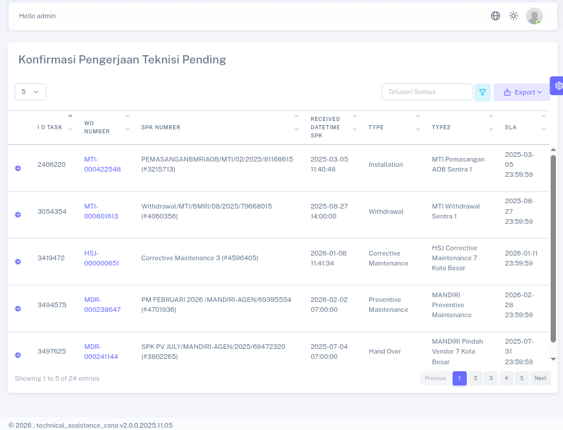
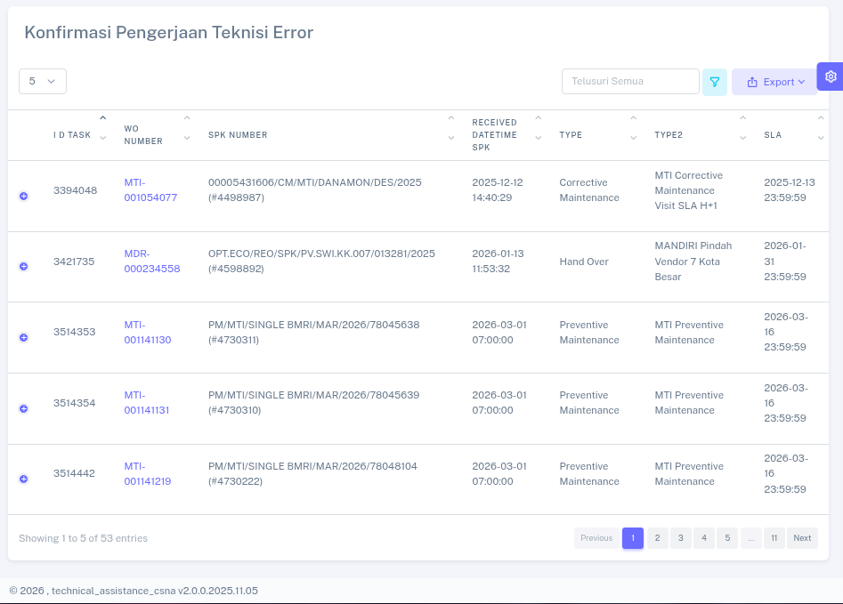
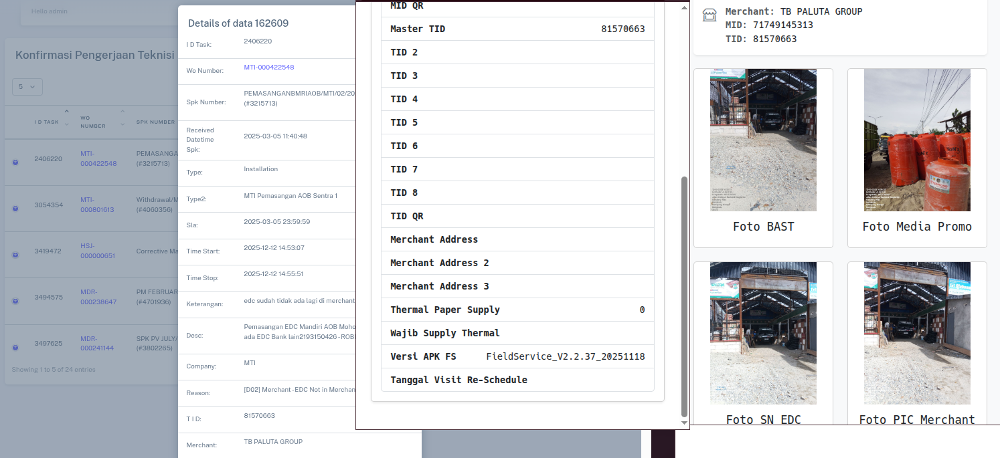
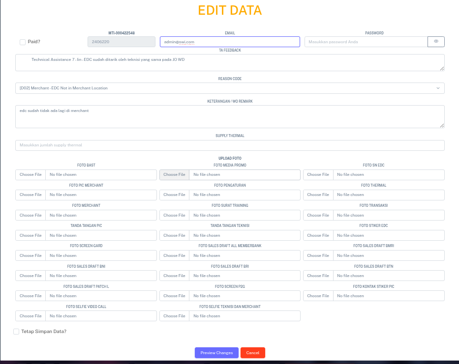
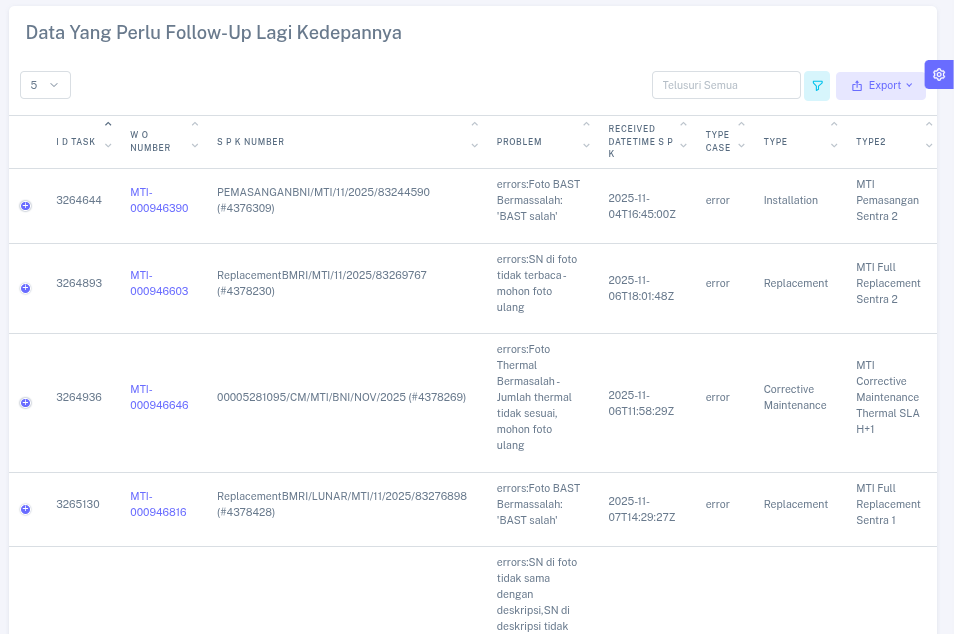
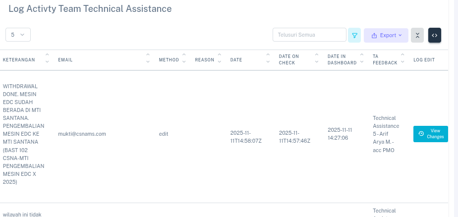
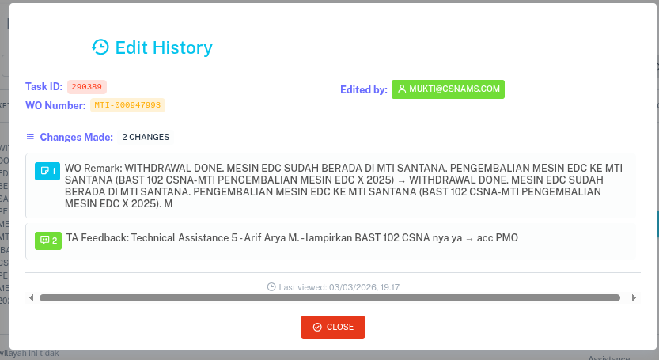

<div align="center">

# Technical Assistance (TA CSNA)

**A full-featured web dashboard for managing Technical Assistance operations — built with Go, Gin, MySQL, Redis, and WebSocket.**

[](https://golang.org/)
[](https://gin-gonic.com/)
[](https://www.mysql.com/)
[](https://redis.io/)
[](LICENSE)

</div>

---

## 📸 Preview

<div align="center">

<!--
  Add your preview images to a `preview/` folder, then replace each src below.
  Recommended format: PNG or JPEG, width ~1280px.
-->

| | | |
|:---:|:---:|:---:|
|  |  |  |
|  |  |  |
|  | | |

</div>

> **Note:** Drop your screenshots into the `preview/` folder and name them `01.png`, `02.png`, etc. The table above will automatically display them as a slide-like gallery.

---

## 📋 Table of Contents

- [Overview](#-overview)
- [Features](#-features)
- [Tech Stack](#-tech-stack)
- [Architecture](#-architecture)
- [Prerequisites](#-prerequisites)
- [Getting Started](#-getting-started)
- [Configuration](#-configuration)
- [Project Structure](#-project-structure)
- [API Routes](#-api-routes)
- [Scheduled Jobs](#-scheduled-jobs)
- [Security](#-security)

---

## 🔍 Overview

**Technical Assistance (TA CSNA)** is an internal operations web application designed to manage and monitor the activities of technical assistance (TA) staff and field technicians (*teknisi*). It provides:

- A **secure multi-role web dashboard** for TA staff and admins.
- Real-time **WebSocket** connections for live data lock and verification.
- Integration with an **Odoo-based operations database** (`odoo_pending`) for tracking pending/error technician workorders.
- **Automated daily reporting** via scheduled email delivery.
- File upload, photo handling, batch XLSX upload, and CSV export.

---

## ✨ Features

| Feature | Description |
|---|---|
| 🔐 Auth & Session | Cookie-based session with AES-encrypted tokens, CAPTCHA, forgot/reset password via email |
| 👥 Admin & Role Management | CRUD for admin users, role definitions, and granular feature-level privilege control |
| 📋 Pending Workorders | View, filter, export, and confirm pending technician workorders from Odoo |
| ❌ Error Workorders | Track and export error workorders with photo evidence |
| ✅ Final Submission | Manage awaiting-final-submission workorders |
| 📝 Activity Log | Full audit trail of all TA actions with CSV export |
| 🧑‍🔧 Technisi Management | CRUD for field technicians, batch XLSX upload, GPS map view, serial number unlocking |
| 📊 TA Reports | Daily, monthly, and comparative reports; auto-sent via email (WIB 17:00 & 21:00) |
| 📁 File Management | Upload, list, and serve uploaded files and images by date-structured paths |
| 💬 WhatsApp Feedback | Receive and process TA feedback via WhatsApp integration |
| 🔌 WebSocket | Real-time data locking to prevent concurrent edits across TA stations |
| 🗂 System Log | View and export timestamped server access logs |
| 📤 CSV / XLSX Export | Export any table to downloadable CSV; batch import from XLSX templates |
| 🔄 Config Hot-Reload | `conf.yaml` watched and reloaded at runtime without restarting the server |
| 📬 Scheduled Email | Cron-based daily summary report emailed to configured recipients |

---

## 🛠 Tech Stack

| Layer | Technology |
|---|---|
| Language | Go 1.22+ |
| Web Framework | [Gin](https://github.com/gin-gonic/gin) |
| ORM | [GORM](https://gorm.io/) |
| Database | MySQL 8.0+ |
| Cache / Session | Redis (via `go-redis`) |
| Real-time | WebSocket (`gorilla/websocket`) |
| Auth | AES-256 encrypted session cookie |
| Email | SMTP via `gomail.v2` |
| Scheduler | `gocron` |
| XLSX | `xuri/excelize` |
| Config | `.env` (godotenv) + `conf.yaml` (hot-reload via fsnotify) |
| Security | `bluemonday` HTML sanitizer, CORS, CSP headers |
| Frontend | Server-rendered HTML templates + static assets |

---

## 🏗 Architecture

```
┌──────────────────────────────────────────────────────────────────┐
│                          Client (Browser)                        │
└────────────┬─────────────────────────────────────┬───────────────┘
             │ HTTP / WebSocket                    │
┌────────────▼─────────────────────────────────────▼────────────────┐
│                      Gin HTTP Server                              │
│  ┌──────────────┐  ┌──────────────────┐  ┌──────────────────────┐ │
│  │  Middleware  │  │    Controllers   │  │      WebSocket       │ │
│  │  Auth / CORS │  │  Business Logic  │  │   (Lock & Verify)    │ │
│  │  Sanitize    │  │                  │  │                      │ │
│  │  Security    │  └────────┬─────────┘  └──────────────────────┘ │
│  └──────────────┘           │                                     │
└─────────────────────────────┼─────────────────────────────────────┘
                              │
              ┌───────────────┼──────────────────┐
              │               │                  │
   ┌──────────▼─────┐  ┌──────▼───────┐  ┌───────▼──────┐
   │  MySQL (Main)  │  │ MySQL (Ops)  │  │    Redis     │
   │  admins        │  │ odoo_pending │  │  sessions    │
   │  roles         │  │ pending      │  │  cache/lock  │
   │  teknisi       │  │ errors       │  └──────────────┘
   │  log_activity  │  │ log_act      │
   │  uploaded_files│  │ submissions  │
   └────────────────┘  └──────────────┘
```

---

## ✅ Prerequisites

- **Go** 1.22 or higher
- **MySQL** 8.0+
- **Redis** 6.0+
- SMTP credentials for email sending
- (Optional) Odoo instance for workorder data integration

---

## 🚀 Getting Started

### 1. Clone the repository

```bash
git clone https://github.com/your-org/technical-assistance.git
cd technical-assistance
```

### 2. Install dependencies

```bash
go mod download
```

### 3. Configure environment

```bash
cp .env.example .env
# Edit .env with your actual values
```

```bash
cp config/conf.example.yaml config/conf.yaml
# Edit conf.yaml with your actual values
```

### 4. Run the application

```bash
go run main.go
```

Or build and run:

```bash
go build -o ta_csna .
./ta_csna
```

The server will start at the port defined by `APP_LISTEN` (default `:8080`).

---

## ⚙️ Configuration

### `.env`

| Variable | Description |
|---|---|
| `GIN_MODE` | `debug` or `release` |
| `REDIS_HOST` / `REDIS_PORT` / `REDIS_DB` | Redis connection |
| `MYSQL_HOST_DB` / `MYSQL_PORT_DB` / `MYSQL_USER_DB` / `MYSQL_PASS_DB` / `MYSQL_NAME_DB` | Main application DB |
| `MYSQL_HOST_DB_KONFIRMASI_PENGERJAAN` / `...` | Odoo operations DB |
| `APP_LISTEN` | HTTP listen address (e.g., `:8080`) |
| `WEB_PUBLIC_URL` | Public base URL of the app |
| `FILESTORE_URL` | URL for external file storage |
| `AES_KEY` / `AES_KEY_IV` | AES-256 encryption key and IV for session tokens |
| `CONFIG_SMTP_HOST` / `CONFIG_AUTH_EMAIL` / `CONFIG_AUTH_PASSWORD` | SMTP credentials |
| `LOGIN_TIME_M` | Session timeout in minutes |
| `APP_LOG_DIR` | Directory for application log files |
| `APP_UPLOAD_DIR` | Directory for user-uploaded files |

### `config/conf.yaml`

| Section | Key fields |
|---|---|
| `EMAIL` | SMTP host, port, credentials, retry settings |
| `DEFAULT` | TA feedback webhook URL |
| `ODOO` | Odoo JSONRPC credentials, URLs, timeouts, allowed company IDs |
| `REPORT` | TO / CC / BCC email lists for scheduled reports |

> `conf.yaml` supports **hot-reload** — changes are applied at runtime without restarting.

---

## 📁 Project Structure

```
technical-assistance/
├── main.go                     # Entry point, server bootstrap, scheduler
├── go.mod / go.sum
├── .env.example                # Environment variable template
├── config/
│   ├── config.go               # YAML config loader with fsnotify hot-reload
│   └── conf.example.yaml       # Config file template
├── routes/
│   └── routes.go               # All HTTP route definitions
├── controllers/                # HTTP handler functions (one file per feature)
├── middleware/                 # Auth, CORS, sanitization, security, logging
├── model/                      # Main DB models (Admin, Role, Teknisi, etc.)
├── models/                     # External/CC models
├── database/
│   ├── db.go                   # DB connection factory
│   └── automigrate_db.go       # Schema migration + seed data
├── fun/                        # Shared utility functions (AES, hashing, cookies, etc.)
├── ws/                         # WebSocket hub logic
├── web/                        # HTML templates and static assets
├── uploads/                    # User-uploaded files (date-structured)
├── filestore/                  # Filestore proxy directory
├── log/                        # Application logs
└── tests/                      # Test files
```

---

## 🌐 API Routes

### Public

| Method | Path | Description |
|---|---|---|
| `GET` | `/login` | Login page |
| `POST` | `/login` | Submit credentials |
| `GET` | `/captcha` | CAPTCHA image |
| `GET` | `/forgot-password` | Forgot password page |
| `POST` | `/forgot-password` | Request password reset email |
| `GET` | `/reset-password/:email/:token` | Reset password page |
| `POST` | `/reset-password/:email/:token` | Submit new password |
| `GET` | `/ta_report` | Generate TA report |
| `GET` | `/send_report` | Manually trigger report email |
| `GET` | `/ws` | WebSocket (verify) |
| `GET` | `/ws-lock` | WebSocket (data lock) |

### Protected (requires auth cookie)

| Route Group | Description |
|---|---|
| `/web/:access/tab-konfirmasi-data-pending` | Pending workorder table + CSV export |
| `/web/:access/tab-konfirmasi-data-error` | Error workorder table + CSV export |
| `/web/:access/tab-konfirmasi-data-submission` | Final submission table + CSV export |
| `/web/:access/tab-log-act` | TA activity log table + CSV export |
| `/web/:access/tab-teknisi` | Technician CRUD, batch upload, maps, serial number unlock |
| `/web/:access/tab-uploaded-file` | Uploaded files table + CSV export |
| `/web/:access/tab-roles` | Role & admin user management |
| `/web/:access/tab-system-log` | System log viewer + CSV dump |
| `/web/:access/tab-activity-log` | Admin activity log + CSV dump |
| `/web/:access/tab-user-profile` | Profile image update, activity table |

---

## 🕐 Scheduled Jobs

| Schedule (WIB) | Action |
|---|---|
| 17:00 daily | Insert/update daily TA summary; send TA daily report email |
| 21:00 daily | Insert/update daily TA summary; send TA daily report email |
| Every 30 min | Rotate and backup `apps.log` to `apps_YYYY_MM_DD.log` |

---

## 🔒 Security

- **AES-256** encrypted session cookies — no plaintext JWT stored client-side.
- **CAPTCHA** on login to block automated attacks.
- **`bluemonday`** HTML sanitizer on all user inputs.
- **CSV injection sanitization** middleware for exported data.
- **Security headers** middleware (CSP, X-Frame-Options, etc.).
- **Role-based access control** with granular feature-level privileges.
- **Redis-backed locking** prevents concurrent edits on the same record via WebSocket.
- **Soft-delete** on admin accounts via GORM `DeletedAt`.